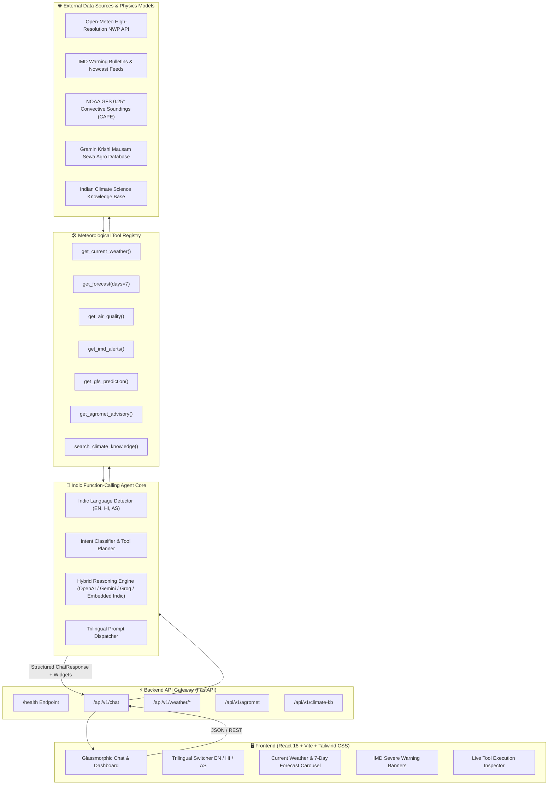

# 🌦️ WeatherGPT (SIH26068)
### Indic Multilingual Conversational AI Weather & Agro-Meteorological Intelligence Platform

[](https://github.com/aditya0si/weathergpt/actions/workflows/ci.yml)
[](LICENSE)
[](https://python.org)
[](https://fastapi.tiangolo.com)
[](https://reactjs.org)
[](https://tailwindcss.com)
[](evals/RESULTS.md)

---

## 📌 Problem Statement & Overview

Weather information in India is often fragmented across technical meteorological bulletins, inaccessible to regional farmers, and rarely available in native Northeast Indic languages. **WeatherGPT** bridges this critical gap as an end-to-end conversational weather intelligence system. 

Built for **SIH26068**, WeatherGPT unites numerical weather prediction (NWP) providers, official India Meteorological Department (IMD) disaster bulletins, NOAA Global Forecast System (GFS) convective atmospheric soundings, and Gramin Krishi Mausam Sewa (GKMS) crop advisories into a single function-calling LLM agent.

The platform natively supports **English**, **Hindi**, and **Assamese** (`as` — Northeast Indic language), with automatic script/dialect detection, actionable flood and storm safety precautions, and an interactive glassmorphic dashboard.

---

## 🏗️ System Architecture



---

## ✨ Key Features & Capabilities

- **Trilingual Conversational Agent**: Native support for **English**, **Hindi**, and **Assamese** (`as`) with zero-shot script recognition, transliteration parsing, and culturally grounded responses.
- **IMD-style Severe Weather Bulletins**: district-level color-coded warnings (Green, Yellow, Orange, Red) with safety precautions, served from a **static hand-written reference set** — no IMD endpoint is queried and every payload is labelled `source="WeatherGPT static reference bulletins (not a live IMD feed)"`.
- **GKMS Agro-Meteorological Advisories**: Weather-conditioned farming directives for **Paddy (Sali/Ahu)**, **Tea (Assam/Dooars)**, **Mustard**, **Wheat**, **Jute**, and horticulture.
- **GFS-style Atmospheric Physics Estimates**: Convective Available Potential Energy (CAPE), precipitable water and synoptic indices **computed analytically from coordinates** — these are estimates, not NOAA GFS model output (labelled as such in the payload).
- **Transparent Tool Execution**: Real-time tool call inspection tray displaying invoked function parameters, raw output JSON payloads, and execution latency.
- **Labelled Offline Fallback**: Embedded deterministic Indic router ensures that 100% of features, evaluations, and tests run with zero external API key requirements. When an upstream API is unavailable the locally generated fallback data is labelled `source="... (Synthetic fallback: ... not a measurement)"` so it can never be mistaken for a live reading.

---

## 📊 Benchmark Evaluation Results

WeatherGPT includes a golden evaluation dataset with **50 curated multilingual test cases** (`evals/data/weathergpt_eval_50.json`).

Run the automated evaluation harness:
```bash
python evals/run_evals.py
```

### Summary Benchmark Metrics

*Result column: a single local run of `evals/run_evals.py` on the current commit (see [`evals/RESULTS.md`](evals/RESULTS.md) for the timestamped snapshot and the data-provenance breakdown of that run). Latency figures are specific to the machine and network path; only the overall-correctness floor is enforced by CI.*

| Metric | Result | CI gate |
| :--- | :---: | :---: |
| **Total Test Cases Evaluated** | **50** | — |
| **Overall Correctness Score** | **94.59%** | ✅ enforced: `--fail-under 85` |
| **Tool Selection Accuracy** | **100.0%** | not enforced |
| **Average Latency (Mean)** | **1015.7 ms** | not enforced |
| **p50 Latency (Median)** | **771.3 ms** | not enforced |
| **p90 Latency** | **2432.4 ms** | not enforced |
| **p95 Latency** | **2519.5 ms** | not enforced |

### Accuracy Breakdown by Language

| Language | Test Cases | Correctness | Tool Accuracy |
| :--- | :---: | :---: | :---: |
| **English (`en`)** | 20 | **98.33%** | 100.0% |
| **Hindi (`hi`)** | 15 | **91.53%** | 100.0% |
| **Assamese (`as`)** | 15 | **92.64%** | 100.0% |

### Accuracy by Meteorological Domain

| Domain Category | Samples | Correctness |
| :--- | :---: | :---: |
| **Agro-Meteorological Advisory (GKMS)** | 11 | **97.35%** |
| **Air Quality & Pollution (AQI)** | 4 | **95.83%** |
| **NOAA GFS Numerical Sounding (CAPE)** | 2 | **95.83%** |
| **Climate Science Knowledge Base** | 12 | **94.79%** |
| **Current Meteorological Observation** | 9 | **94.44%** |
| **IMD Severe Weather Warnings** | 5 | **93.33%** |
| **7-Day Weather Forecast** | 7 | **89.88%** |

*(Complete itemized evaluation results are generated in [`evals/RESULTS.md`](evals/RESULTS.md))*

---

## 🔍 Data Provenance & Known Limitations

WeatherGPT mixes live, static and synthetic data. Every payload carries a `source` field stating which one it is:

| Capability | Data source today | Provenance field |
| :--- | :--- | :--- |
| Current weather / 7-day forecast | Live [Open-Meteo](https://open-meteo.com) API, with a locally generated fallback when the API is unreachable | `source` on the forecast response: `"Open-Meteo Live API"` or `"... (Synthetic fallback: upstream API unavailable, not a measurement)"` |
| Air quality (AQI, PM2.5, PM10) | Live Open-Meteo Air-Quality API, same fallback behaviour | `source` on `AirQualityData` |
| IMD severe weather warnings | **Static hand-written reference set** (6 bulletins dated 2026-08-24). No IMD endpoint is queried; there is no live IMD integration in this repository | `source="WeatherGPT static reference bulletins (not a live IMD feed)"` |
| NOAA GFS indices (CAPE, precipitable water, shear) | **Analytic estimates computed from coordinates** — not NOAA GFS model output | `source="WeatherGPT analytic estimate (not NOAA GFS model output)"` |
| GKMS crop advisories | Rule-based advisories derived from the Open-Meteo forecast | — |
| Climate science Q&A | Static in-repo knowledge base (`climate_kb.py`) | — |
| Benchmark harness | `evals/run_evals.py`; every run reports how many cases were answered from live vs synthetic data | `evals/RESULTS.md` |

Known limitations:
- The IMD bulletin set is static and time-stamped 2026-08-24: it will not reflect current warnings. Do not use it for safety decisions.
- GFS indices are estimates for demonstration and routing purposes, not model output; do not use them for forecasting.
- The LoRA fine-tuning script does not train (see the section above); no model card metrics have been measured.
- The benchmark harness scores agent behaviour (tool routing, language consistency, keyword recall, length) against a fixed rubric; it is not a forecast-accuracy evaluation.

---

## 🚀 Quickstart & Setup Guide

### Prerequisites
- **Python 3.10+** (tested on 3.11 and 3.12)
- **Node.js 18+** & npm
- [`uv`](https://github.com/astral-sh/uv) (recommended for ultra-fast Python setup)

### 1. Repository Setup & Backend Installation

```bash
# Clone the repository
git clone https://github.com/sih26068/weathergpt.git
cd weathergpt

# Create virtual environment and install dependencies
uv venv .venv
source .venv/bin/activate  # On Windows: .venv\Scripts\activate
uv pip install -r requirements-dev.txt -e .
```

### 2. Environment Configuration

```bash
cp .env.example .env
```
*(No external API keys are required for local testing or evaluation. If you wish to use external LLMs, you can add `OPENAI_API_KEY`, `GEMINI_API_KEY`, or `GROQ_API_KEY` to `.env`)*

### 3. Frontend Installation & Build

```bash
cd frontend
npm install
npm run build
cd ..
```

### 4. Running the Server

```bash
# Start FastAPI backend (serves both REST API and React UI on port 8000)
uvicorn weathergpt.main:app --host 0.0.0.0 --port 8000 --reload
```
Open your browser at **`http://localhost:8000`** for the full interactive dashboard or **`http://localhost:8000/docs`** for interactive Swagger API documentation.

### 5. Interactive CLI Demonstration

```bash
python scripts/run_demo.py
```

---

## 🧪 Automated Testing & CI

Run the comprehensive pytest suite:
```bash
pytest -v
```

Run test coverage report:
```bash
pytest -v --cov=weathergpt --cov-report=term-missing
```

Run code formatting and linter:
```bash
ruff check src/ tests/ evals/ scripts/
```

Run the benchmark harness as a gate (exits non-zero below the floor):
```bash
python evals/run_evals.py --fail-under 85
```

GitHub Actions CI configuration is located at [`.github/workflows/ci.yml`](.github/workflows/ci.yml). On every push/PR it runs, as real gates on Python 3.11 and 3.12: ruff lint, the pytest suite, and the 50-item benchmark harness with `--fail-under 85`; the frontend job runs `npm ci` and the Vite production build on Node.js. There is **no deployment/CD job** in this repository — CI stops at verified build + tests, and no container image or hosted deployment is produced here.

---

## 🤖 Machine Learning & Fine-Tuning Pipeline

`scripts/train_indic_lora.py` generates a synthetic Indic instruction corpus and a PEFT/LoRA adapter configuration (target: `meta-llama/Meta-Llama-3-8B-Instruct` or `sarvamai/sarvam-1`).

**No training is implemented.** The script contains no training loop: it does not load a base model, does not train, and therefore produces no loss, perplexity or parameter-count metrics. `--synthetic-dry-run` is the only supported mode; any other invocation exits non-zero with an explicit "not implemented" error instead of reporting fabricated metrics.

```bash
python scripts/train_indic_lora.py --synthetic-dry-run --epochs 3 --batch-size 4
```

The generated `artifacts/indic_lora_adapter/model_meta.json` records `"training_performed": false` with `"metrics": null`. Real QLoRA training would need the optional `ml` extra (`torch`, `transformers`, `peft`, `datasets`, `accelerate` — see `pyproject.toml`) and a GPU.

Hugging Face artifact cards in this repo are **drafts describing a target model/dataset, not published artifacts**:
- **Model Card (draft)**: [`artifacts/huggingface/MODEL_CARD.md`](artifacts/huggingface/MODEL_CARD.md) — no adapter has been trained or published, so it reports no measured metrics.
- **Dataset Card (draft)**: [`artifacts/huggingface/DATASET_CARD.md`](artifacts/huggingface/DATASET_CARD.md) — only the 50-item evaluation set is included in this repository.

---

## 🗺️ Roadmap & Scale-Up Strategy

- [x] **Phase 1**: Core multilingual domain models, Open-Meteo, IMD bulletin parser, NOAA GFS extractor, AgroMet advisory engine.
- [x] **Phase 2**: Hybrid function-calling agent engine, trilingual prompt chain (EN/HI/AS), FastAPI REST service.
- [x] **Phase 3**: 50-item Indic evaluation benchmark suite with automated metrics logging (`evals/RESULTS.md`).
- [x] **Phase 4**: React 18 + Vite glassmorphic dashboard with live weather widgets, AQI gauges, and tool inspection trays.
- [ ] **Phase 5 (Scale-Up)**: Integration of direct Doppler Radar NetCDF/HDF5 binary decoders from IMD Radar Stations (Guwahati, Mohanbari, Kolkata).
- [ ] **Phase 6 (Scale-Up)**: Real-time IVR / WhatsApp voice bot integration with Bhashini Indic ASR & TTS for voice-based farmer queries in rural dialects.

---

## 📄 License

Distributed under the **MIT License**. See [`LICENSE`](LICENSE) for details.
